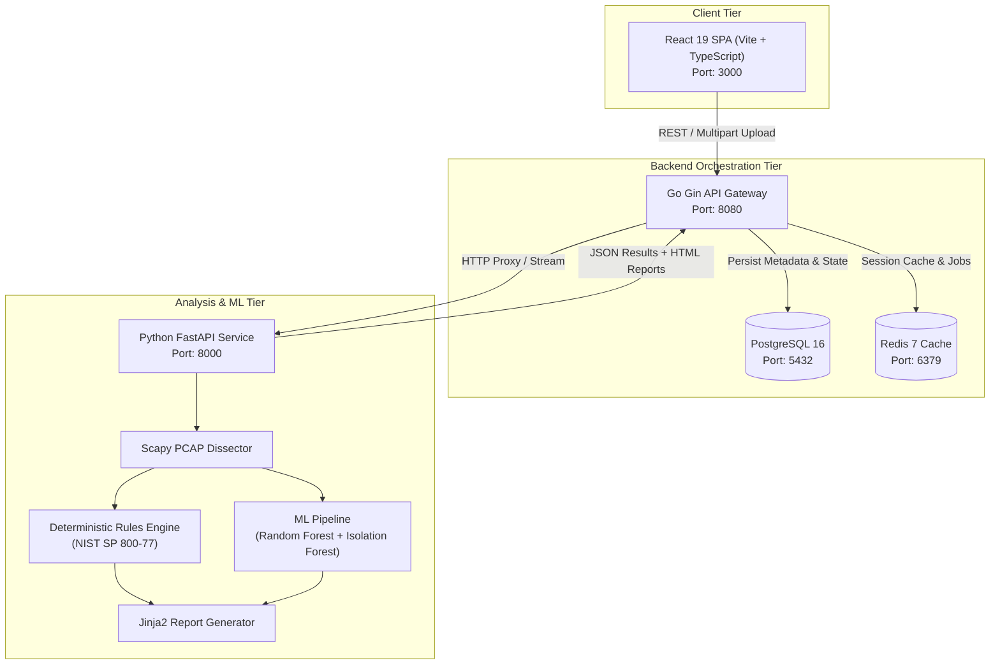
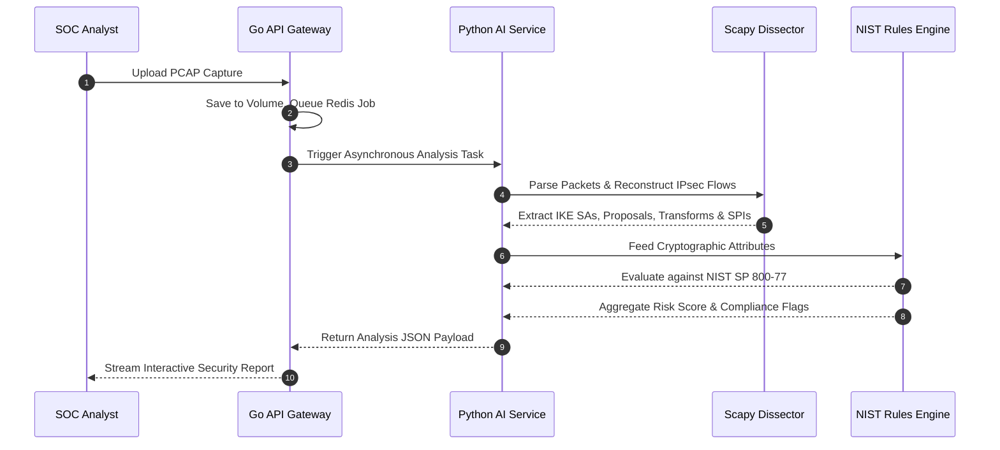
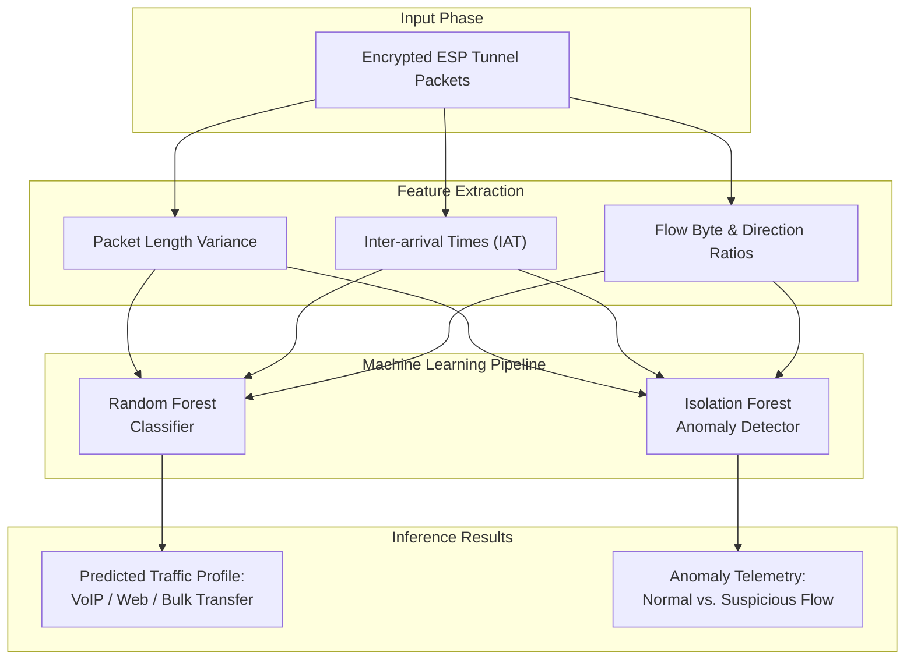

<div align="center">
  
  <h1>🛡️ VANTAGE: IPsec/IKE VPN Security Platform</h1>
  <p>
    <strong>Automated PCAP packet dissection, NIST SP 800-77 cryptographic assessment, and encrypted ESP traffic inference for enterprise & defense VPN deployments.</strong>
  </p>

  [](https://go.dev/)
  [](https://python.org/)
  [](https://react.dev/)
  [](https://fastapi.tiangolo.com/)
  <br />
  [](https://www.postgresql.org/)
  [](https://redis.io/)
  [](https://www.docker.com/)

</div>

<br />

> **VANTAGE** is a modern, enterprise-grade network security analysis platform designed to ingest, dissect, classify, and audit **IPsec (ESP/AH)** and **IKE (v1/v2)** packet captures (`.pcap`, `.pcapng`, `.cap`). Built with a hybrid engine combining deterministic RFC/NIST cryptographic compliance evaluation, machine learning traffic inference, and statistical anomaly detection with full model provenance.

---

## 📑 Table of Contents

<details>
<summary>Click to expand</summary>

- [Overview & Key Features](#-overview--key-features)
- [System Architecture](#-system-architecture)
- [Technology Stack](#-technology-stack)
- [Repository Structure](#-repository-structure)
- [Getting Started](#-getting-started)
- [Configuration & Environment Variables](#-configuration--environment-variables)
- [REST API Reference](#-rest-api-reference)
- [Analysis Engine & Method Attribution](#-analysis-engine--method-attribution)
- [Compliance & Security Standards](#-compliance--security-standards)
- [Testing & Synthetic PCAP Generation](#-testing--synthetic-pcap-generation)

</details>

---

## 🌟 Overview & Key Features

Modern enterprise networks rely on IPsec tunnels for zero-trust perimeter defense and site-to-site connectivity. However, configuration drift, legacy ciphers (3DES, MD5, DH Groups 1/2), missing Perfect Forward Secrecy (PFS), and disabled replay protection leave infrastructure vulnerable to eavesdropping, Logjam, Sweet32, and replay attacks.

**VANTAGE** provides automated, deep packet-level cryptographic visibility:

- 🔍 **Deterministic Protocol Dissection**: Deep packet inspection of IKEv1/IKEv2 exchanges (ISAKMP Security Associations, Proposals, Transforms, Key Exchanges, Nonces, Vendor IDs) and ESP/AH encapsulation headers via Scapy.
- ⚖️ **NIST-Aligned Cryptographic Auditing**: Evaluates cipher suites against NIST SP 800-77 Rev 1, CNSA Suite, and RFC specifications. Computes granular 0–100 risk scores with weighted penalties.
- 🤖 **Hybrid ML Traffic Inference & Anomaly Detection**:
  - **Random Forest Classifier**: Classifies encrypted tunnel traffic profiles (VoIP, interactive shell, bulk data transfer).
  - **Isolation Forest Anomaly Detector**: Detects out-of-distribution traffic burstiness, packet length variance anomalies, and potential tunnel data exfiltration.
- 🏷️ **Strict Model Transparency & Provenance**: Every security finding and traffic metric is explicitly tagged with its origin and linked to registered Model Cards.
- 📊 **Interactive Investigation Workspace**: Real-time ESP sequence number continuity inspection, SPI session tracking, and threat matrix mapping.
- 🔄 **Capture Comparison Diff Engine**: Side-by-side visual diffing of two captures to verify migration outcomes and configuration drift.
- 🛠️ **Remediation Center**: Generates ready-to-deploy configuration snippets and hardening commands for Cisco ASA, strongSwan, Fortinet FortiOS, and Linux `ip xfrm`.

---

## 🏗️ System Architecture

### High-Level Service Topology



### IKEv2 / ESP Dissection Protocol Flow



### ML Traffic Inference & Anomaly Detection Flow



<br />

<details>
<summary><b>View Microservice Breakdown</b></summary>
<br/>

| Service | Technology | Port | Purpose |
| :--- | :--- | :--- | :--- |
| **Frontend** | React 19, TypeScript, Vite, Recharts, Lucide | `3000` | Responsive SOC/NOC dashboard, upload workbench, comparison viewer, report previewer. |
| **Backend** | Go 1.23, Gin, pgx, go-redis | `8080` | High-throughput API gateway, job coordinator, relational persistence, and Redis caching. |
| **AI Service** | Python 3.11, FastAPI, Scapy, scikit-learn, Jinja2 | `8000` | Protocol parsing, deterministic scoring, ML traffic classification, and HTML report compilation. |
| **Database** | PostgreSQL 16 (Alpine) | `5432` | Relational storage for captures, analysis runs, security findings, and anomaly telemetry. |
| **Cache** | Redis 7 (Alpine) | `6379` | Fast job status tracking, response caching, and rate limiting buffers. |

</details>

---

## 💻 Technology Stack

- **Frontend**: React 19, TypeScript 6.0, Vite 8.2, React Router 7, Recharts 3.10.
- **Backend**: Go 1.23, Gin Web Framework 1.10, `pgx/v5` PostgreSQL Driver, `go-redis/v9`.
- **AI & Analytics Engine**: Python 3.11, FastAPI 0.115, Scapy 2.6, scikit-learn 1.5, Pandas 2.2.
- **Infrastructure**: Docker & Docker Compose v2, PostgreSQL 16, Redis 7.

---

## 🚀 Getting Started

### Prerequisites

- **Docker & Docker Compose**: Docker Desktop 4.20+ (with Compose v2)
- **Node.js**: `v18.x` or `v20.x+` *(only for non-Docker frontend development)*
- **Go**: `1.22+` *(only for non-Docker backend development)*
- **Python**: `3.10+` *(only for non-Docker AI service development)*

### Quickstart with Docker Compose (Recommended)

Start all services (PostgreSQL, Redis, AI Service, and Go Backend) with a single command:

```bash
git clone https://github.com/amshithnair/ipsec-vpn.git
cd ipsec-vpn
cp .env.example .env

# Launch the stack
docker compose up -d --build
```

**Access the application:**
- 🌐 **Web Dashboard**: `http://localhost:3000`
- 🔌 **Go Backend API**: `http://localhost:8080/api/v1/health`
- 🧠 **Python AI Service**: `http://localhost:8000/health`

---

## 🧠 Analysis Engine & Method Attribution

Every metric emitted by the pipeline contains strict provenance attribution to distinguish between formal cryptographic verification and statistical inference:

| Method Source | Description |
| :--- | :--- |
| `DETERMINISTIC_RULES` | Hard rule matches against NIST SP 800-77, RFC 7296, RFC 2409, and parsed packet bytes. |
| `ML_TRAFFIC_INFERENCE` | Supervised Random Forest classification of payload entropy and packet length dynamics. |
| `ML_ANOMALY` | Unsupervised Isolation Forest detection of out-of-band bursts and flow irregularities. |

> **Risk Scoring Formula:**
> The deterministic security score starts at `0` (clean) and accumulates weighted penalties based on findings:
>
> $$\text{Risk Score} = \min\left(100, \sum (\text{Rule Penalty} \times \text{Category Weight})\right)$$

---

## 📜 Compliance & Security Standards

The platform evaluates configurations against industry cryptographic standards:

- 🛡️ **NIST SP 800-77 Rev. 1**: Guide to IPsec VPNs.
- 🛡️ **NIST SP 800-131A Rev. 2**: Transitioning the Use of Cryptographic Algorithms and Key Lengths.
- 📄 **RFC 7296**: Internet Key Exchange Protocol Version 2 (IKEv2).
- 📄 **RFC 8221**: Cryptographic Algorithm Implementation Requirements for ESP and AH.
- 🔐 **NSA CNSA**: Commercial National Security Algorithm Suite 1.0 & 2.0.

---

## 🧪 Testing & Synthetic PCAP Generation

Use the bundled generator script to synthesize realistic test PCAP files representing different security postures:

```bash
cd apps/ai-service
python -m venv venv
.\venv\Scripts\Activate.ps1  # Windows
pip install -r requirements.txt

cd ../../scripts
python generate_demo_pcaps.py
```

Generated files in `data/demo_pcaps/`:
- 🔴 `legacy_weak_ikev1.pcap` — 3DES-CBC + MD5 + DH Group 2 + IKEv1 (Critical Risk).
- 🟢 `modern_secure_ikev2.pcap` — AES-256-GCM + SHA-384 + ECDH + IKEv2 (Low Risk).
- 🟡 `mixed_enterprise.pcap` — AES-128-CBC + SHA-1 + DH Group 14 + IKEv2 (Medium Risk).
- 🟣 `anomaly_burst_tunnel.pcap` — Synthetic flow with artificial jitter (Triggers Isolation Forest).

---

## 📄 License

This project is licensed under the **MIT License**. See `LICENSE` for details.
