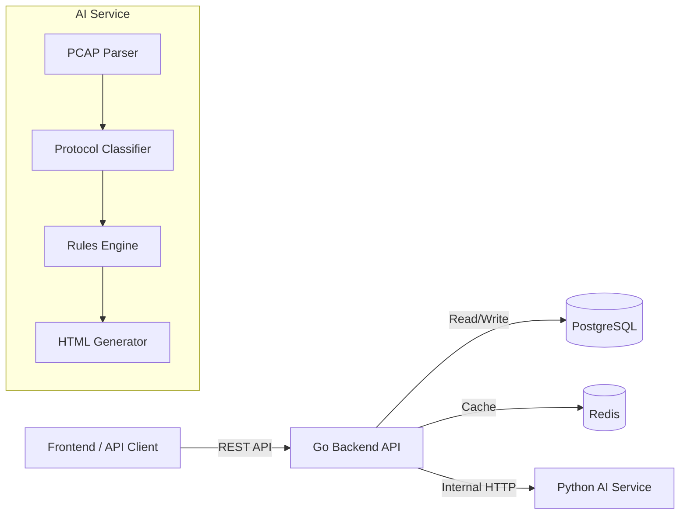

<div align="center">
  
  
  
  
</div>

<br />

<div align="center">
  <h1>🛡️ IPSEC-VPN Protocol Analyzer</h1>
  <p><strong>Next-Generation AI-Powered IPsec Security Assessment Platform</strong></p>
</div>

<hr />

## 🌟 Overview

The **IPSEC-VPN Protocol Analyzer** is an automated, high-performance platform designed to ingest raw network traffic (PCAPs), dissect complex IPsec/IKE negotiations, and evaluate cryptographic strength against modern security standards.

Instead of manually digging through Wireshark to find whether Perfect Forward Secrecy (PFS) was used or if a weak Diffie-Hellman group was negotiated, this platform automates the entire process and provides a clear, actionable HTML security report.

## 🚀 Key Features

- **🧠 Intelligent Protocol Dissection**: Uses Scapy with custom IKE payload parsing to extract exact encryption algorithms, authentication hashes, DH groups, and PFS state.
- **⚡ High-Performance Architecture**: 
  - **Go Backend**: Handles high-concurrency uploads, asynchronous job orchestration, and REST API routing.
  - **Python AI Service**: Stateless, compute-heavy engine that performs the deep packet inspection and classification.
- **🛡️ Deterministic Rules Engine**: Evaluates cryptographic strength based on NIST guidelines. Instantly flags weak algorithms like 3DES, MD5, and DH Group 2.
- **📊 Professional HTML Reports**: Automatically generates stunning, shareable technical security reports with risk scoring, findings, and evidence.
- **🐳 Fully Dockerized**: Spin up the entire stack (Go, Python, Postgres, Redis) with a single command.

## 🏗️ Architecture

The system operates as a monorepo containing distinct, decoupled services:



## 🛠️ Tech Stack

- **Backend**: Go (Gin, pgx)
- **AI/Analysis Engine**: Python (FastAPI, Scapy, Pydantic)
- **Database**: PostgreSQL 16
- **Cache**: Redis 7
- **Orchestration**: Docker & Docker Compose

## 🚀 Getting Started

### Prerequisites
- Docker and Docker Compose
- Go 1.23+ (for local development)
- Python 3.11+ (for local development)

### Quick Start

1. **Clone the repository**
2. **Start the stack**
   ```bash
   docker-compose up -d --build
   ```
3. **Check the services**
   - Go Backend: `http://localhost:8080/api/v1/health`
   - Python AI Service: `http://localhost:8000/health`
   - PostgreSQL: `localhost:5432`
   - Redis: `localhost:6379`

## 🧪 Testing

We provide a comprehensive PowerShell test suite that automatically generates demo PCAPs and tests the entire API lifecycle.

1. **Generate Demo PCAPs and Run Tests**
   ```powershell
   # Run the full API E2E test suite
   .\scripts\test-api.ps1
   
   # Run the isolated AI service test suite
   .\scripts\test-ai-service.ps1
   ```

The test suites will validate uploads, async analysis orchestration, risk scoring accuracy (contrasting strong vs weak PCAPs), and report generation.

## 📂 Documentation

- [API Documentation](./docs/api-docs.md)
- [Architecture & Engineering Decisions (ADR)](./docs/engineering-decisions.md)

---
<div align="center">
  <i>Built with 🛡️ for network security engineers.</i>
</div>
